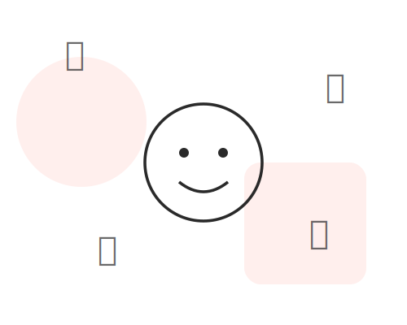
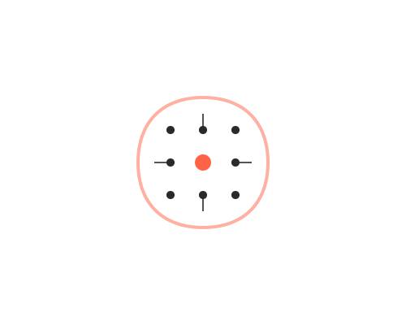

# Project Brief: Mood-Based Food Recommendation Website Frontend

## 1\. Project Overview

**Goal:** To build the frontend for a web application that recommends food and music to users based on their mood, which is determined by analyzing a photo of their face.

**Core Features:**

- A clean, modern, and engaging user interface.
- A camera module to capture a user's photo.
- Dynamic display of results (food and music recommendations) after a simulated mood analysis.

**Technology Stack:**

- **HTML5** (for structure)
- **CSS3** (for styling, including Flexbox/Grid for layout)
- **Vanilla JavaScript (ES6+)** (for all interactivity, DOM manipulation, and camera access)
- No external libraries or frameworks (e.g., jQuery, React, Vue) are to be used.

## 2\. Suggested File Structure

Please create the following file structure for the project:

```
/mood-food-app
|-- index.html
|-- style.css
|-- script.js
|-- /assets
    |-- /images
        |-- logo.svg
        |-- hero-illustration.svg
        |-- features-illustration.svg
    |-- /icons
        |-- zomato-icon.svg
        |-- swiggy-icon.svg
        |-- spotify-icon.svg
        |-- youtube-music-icon.svg
```

_Note: Please use high-quality, playful, and modern illustrations for the hero and features sections. You can use placeholders from services like `undraw.co` if final assets are not available._

## 3\. HTML Structure (`index.html`)

Create the main HTML file with the following semantic structure.

```html
<!DOCTYPE html>
<html lang="en">
  <head>
    <meta charset="UTF-8" />
    <meta name="viewport" content="width=device-width, initial-scale=1.0" />
    <title>MoodFood - Find Food that Fits Your Mood</title>
    <link rel="stylesheet" href="style.css" />
    <script src="script.js" defer></script>
  </head>
  <body>
    <header>
      <nav class="container">
        <a href="/" class="logo">
          
        </a>
      </nav>
    </header>

    <main>
      <section id="hero" class="container">
        <div class="hero-text">
          <h1>Feeling hungry? Let your face decide your feast.</h1>
          <p>
            Our AI analyzes your mood in a snap and suggests the perfect meal to
            match your vibe. Stop scrolling, start smiling (or frowning)!
          </p>
          <a href="#mood-scanner" class="cta-button">Try the Mood Scanner</a>
        </div>
        <div class="hero-image">
          
        </div>
      </section>

      <section id="mood-scanner" class="container">
        <h2>Scan Your Mood</h2>
        <div id="scanner-box">
          <div id="camera-container">
            <video id="camera-feed" autoplay playsinline muted></video>
            <canvas id="photo-canvas" style="display:none;"></canvas>
            <p id="guidance-message">Click "Start Camera" to begin.</p>
          </div>
          <button id="start-camera-btn">Start Camera</button>
          <button id="scan-mood-btn" class="hidden">Scan My Mood</button>
        </div>
        <div id="results-container" class="hidden"></div>
      </section>

      <section id="features" class="container">
        <div class="feature-image">
          
        </div>
        <div class="feature-text">
          <h2>Powered by Advanced AI</h2>
          <p>
            Our sophisticated machine learning model understands the subtle
            nuances of your facial expressions to give you surprisingly accurate
            and delightful recommendations. Haven't tried it yet? What are you
            waiting for?
          </p>
          <a href="#mood-scanner" class="cta-button">Find Your Flavor</a>
        </div>
      </section>
    </main>

    <footer>
      <div class="container">
        <ul class="footer-links">
          <li><a href="#">About Us</a></li>
          <li><a href="#">Privacy Policy</a></li>
          <li><a href="#">Contact</a></li>
        </ul>
        <p class="copyright">&copy; 2025 MoodFood. All Rights Reserved.</p>
      </div>
    </footer>
  </body>
</html>
```

## 4\. CSS Styling (`style.css`)

Please implement the following styling guidelines.

**General & Variables:**

- Use CSS custom properties (variables) for the color palette and font sizes for easy maintenance.
- Set `box-sizing: border-box;` for all elements.
- Use a modern, readable font from Google Fonts (e.g., 'Poppins' or 'Manrope').
- Create a `.container` class for consistent content width and centering.
- Create a `.hidden` class with `display: none;` to toggle element visibility.

**Header:**

- Simple, clean header with padding.
- Ensure the logo is appropriately sized.

**Hero & Features Sections:**

- Use Flexbox or CSS Grid to create a two-column layout (text on one side, image on the other).
- On mobile devices (\< 768px), stack the columns vertically.
- Style the `.cta-button` to be prominent, with a background color, padding, border-radius, and a hover effect.

**Mood Scanner Section:**

- Center the content within the section.
- Style the `#scanner-box` with a subtle border and box-shadow.
- The `#camera-feed` video element should have a `max-width` of 100% and `border-radius`.
- The `#guidance-message` should be clearly visible, perhaps overlaid on the video feed area initially.
- Buttons should have clear, consistent styling.

**Results Container:**

- The `#results-container` should be styled to present information clearly.
- Use Flexbox for laying out food and music recommendations.
- Create classes for recommendation cards (`.food-card`, `.music-card`) with icons and links.

**Footer:**

- Simple, dark background with light text.
- Use Flexbox to lay out the links and copyright text.

## 5\. JavaScript Logic (`script.js`)

Implement the frontend logic. The interaction with the backend ML model will be **simulated**.

**1. DOM Element Selection:**

- At the top of the file, get references to all necessary DOM elements: `start-camera-btn`, `scan-mood-btn`, `camera-feed` (video), `photo-canvas`, `guidance-message`, and `results-container`.

**2. Camera Logic:**

- Add a `click` event listener to `start-camera-btn`.
- **Handler Function (`startCamera`)**:
  - Use an `async/await` block.
  - Inside a `try...catch` block, request camera access using `navigator.mediaDevices.getUserMedia({ video: true })`.
  - If successful:
    - Set the `srcObject` of the video element to the returned stream.
    - Hide `start-camera-btn` and the initial `guidance-message`.
    - Show `scan-mood-btn`.
  - If it fails (in the `catch` block), update the `guidance-message` to inform the user that camera access was denied or failed.

**3. Image Capture & Analysis Logic:**

- Add a `click` event listener to `scan-mood-btn`.
- **Handler Function (`scanMood`)**:
  - Update the UI to show a "loading" or "analyzing..." state.
  - Get the `canvas` context (`2d`).
  - Set the canvas dimensions to match the video feed's dimensions.
  - Draw the current frame from the `<video>` element onto the `<canvas>` using `drawImage()`.
  - **Simulate Backend API Call:**
    - Call a function `getMoodAnalysis()`. This function will mimic a `fetch` request to your backend.
    - `getMoodAnalysis()` should not make a real network request. Instead, it should return a `Promise` that resolves after a 2-second delay (using `setTimeout`).
    - The promise should resolve with a randomly selected mock data object. See the "Mock Data" section below.

**4. Displaying Results:**

- In the `.then()` block after `getMoodAnalysis()` resolves:
  - Get the mood data from the resolved promise.
  - Call a function `updateResultsUI(data)` to populate the results container.
- **`updateResultsUI(data)` Function:**
  - Clear any previous results from `#results-container`.
  - Create HTML elements dynamically to display the results. The structure should be like this:
    ```html
    <h3>Looks like you're feeling ${data.mood}!</h3>
    <p>How about some comforting ${data.food.name} to lift your spirits?</p>
    <div class="delivery-links">
      <a href="${data.food.links.zomato}" target="_blank">Order on Zomato</a>
      <a href="${data.food.links.swiggy}" target="_blank">Order on Swiggy</a>
    </div>
    <h4>Vibes to match:</h4>
    <div class="song-recommendations">
      <a href="${song.link}" target="_blank">${song.title} by ${song.artist}</a>
    </div>
    ```
  - Append this new HTML to the `#results-container`.
  - Remove the `.hidden` class from `#results-container` to make it visible.

**5. Mock Data (for Simulation):**

- Create an array of mock mood objects. The `getMoodAnalysis` function will randomly pick one from this array to return.

<!-- end list -->

```javascript
// Example Mock Data Structure
const mockMoodData = [
  {
    mood: "Happy",
    food: {
      name: "Pizza",
      links: { zomato: "#", swiggy: "#" },
    },
    music: [
      { title: "Happy", artist: "Pharrell Williams", link: "#" },
      { title: "Don't Stop Me Now", artist: "Queen", link: "#" },
    ],
  },
  {
    mood: "Sad",
    food: {
      name: "Ice Cream",
      links: { zomato: "#", swiggy: "#" },
    },
    music: [
      { title: "Someone Like You", artist: "Adele", link: "#" },
      { title: "Fix You", artist: "Coldplay", link: "#" },
    ],
  },
  {
    mood: "Stressed",
    food: {
      name: "Dark Chocolate",
      links: { zomato: "#", swiggy: "#" },
    },
    music: [
      { title: "Weightless", artist: "Marconi Union", link: "#" },
      { title: "Clair de Lune", artist: "Claude Debussy", link: "#" },
    ],
  },
  // Add more moods: Surprised, Angry, Neutral, etc.
];
```
